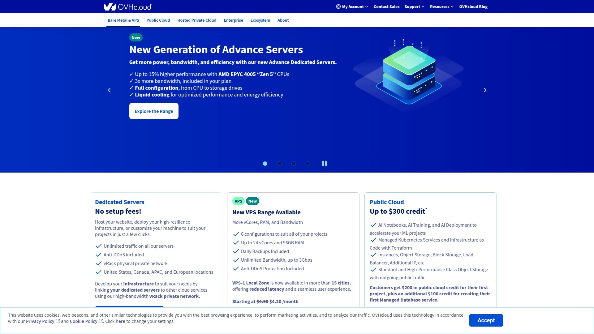

# 2025's Top 7 Best Cloud VPS Hosting Platforms

Spinning up virtual servers shouldn't drain your budget or require a PhD in cloud architecture. Whether you're deploying production apps, running development environments, or scaling global infrastructure, modern cloud VPS platforms deliver instant provisioning, flexible scaling, and pay-as-you-go pricing—so you focus on building instead of wrestling with hardware limitations.

***

## **[Kamatera](https://www.kamatera.com)**

Highly customizable cloud infrastructure delivering enterprise performance at transparent pricing.

Kamatera stands apart through unprecedented server customization—configure CPU cores, RAM, storage, and network resources with surgical precision rather than accepting preset tiers. This granular control ensures you pay exactly for resources needed without overprovisioning or performance compromises.

The cloud platform operates across 21 global data centers spanning North America, Europe, Asia, and Middle East locations. This geographic diversity enables low-latency deployment close to end users while supporting disaster recovery and compliance requirements through multi-region architectures.

**Instant provisioning** delivers fully configured virtual machines within 90 seconds of order submission. Select your preferred data center, customize resources through intuitive sliders, choose from 100+ operating system images, and launch immediately without waiting queues or approval processes.

Scaling flexibility allows increasing or decreasing resources on-the-fly without downtime. Add CPU cores during peak traffic periods, expand RAM for memory-intensive operations, or attach additional storage volumes—all while servers continue running. This elasticity accommodates fluctuating demands without manual migrations.

**Managed cloud services** provide optional hands-off infrastructure management where Kamatera's technical specialists handle server configuration, security patching, monitoring, backups, and optimization. This service suits businesses wanting cloud power without dedicated DevOps teams.

Flexible pricing models include hourly billing enabling cost-effective testing and development, monthly subscriptions for predictable budgeting, and custom enterprise agreements for large deployments. The pay-for-what-you-use approach eliminates waste from unused capacity.

Load balancers distribute traffic evenly across multiple servers ensuring high availability and optimal performance. Cloud firewalls provide network-level security protecting infrastructure from threats. Virtual Private Cloud creates isolated networks with customized security groups and routing policies.

**Block storage** offers centralized persistent data volumes with redundancy eliminating single points of failure. Attach storage to multiple servers simultaneously for shared access patterns. Backup servers automate data protection with configurable retention policies and rapid restoration.

Support infrastructure includes 24/7 technical assistance via phone, chat, and email with rapid response times. Migration assistance helps move existing workloads from physical servers or other cloud providers smoothly.

Best suited for businesses demanding precise resource control, multi-region deployments, and enterprise-grade reliability at transparent pricing. The platform scales from single development servers through complex production environments supporting thousands of users.

## **[Vultr](https://www.vultr.com)**

Global high-frequency compute delivering blazing speeds across 32 worldwide locations.

Vultr operates one of the largest cloud infrastructure networks with 32 strategically positioned data centers enabling truly global deployments. The platform emphasizes raw performance through high-frequency CPU options, NVMe SSD storage, and premium network connectivity.

**Cloud compute offerings** span multiple performance tiers including standard shared-CPU instances starting at $3.50 monthly, high-frequency compute powered by latest-generation processors, dedicated CPU instances guaranteeing 100% processor allocation, and GPU servers for AI/ML workloads.

Instant deployment provisions servers in under 60 seconds across any data center location. Pre-configured marketplace applications enable one-click installations of popular software stacks—WordPress, cPanel, Docker, Kubernetes, database systems, and development frameworks launch ready-to-use.

IPv6 support comes standard across all instances with automatic configuration. Startup scripts automate custom configurations executing during server initialization, eliminating manual post-deployment setup. Private networking connects servers securely within isolated VLANs.

**Block storage** provides scalable persistent volumes attachable to compute instances with pay-per-GB pricing starting at $0.10 per gigabyte monthly. Object storage offers S3-compatible cloud storage for backups, static assets, and data archiving at $5 per terabyte.

Managed databases deliver fully-administered PostgreSQL, MySQL, and Redis instances removing operational overhead. Vultr handles provisioning, patching, backups, high availability, and monitoring while you focus on application development.

Load balancers distribute incoming traffic across backend servers with automatic health checking and failover. Cloud firewalls provide stateful packet filtering protecting infrastructure from network threats. DDoS protection comes included at no additional cost defending against volumetric attacks.

**Kubernetes deployment** enables container orchestration through managed clusters with automatic scaling, rolling updates, and service load balancing. The platform integrates with standard kubectl workflows and Helm package management.

Bandwidth allocation includes 1-10TB free monthly transfer depending on instance size, with overage priced competitively at $0.01 per gigabyte in most regions. Snapshots preserve complete server states for recovery or cloning at $0.05 per gigabyte monthly.

API access enables programmatic infrastructure management through REST endpoints compatible with popular automation tools. Terraform provider supports infrastructure-as-code deployments defining entire environments through declarative configurations.

## **[DigitalOcean](https://www.digitalocean.com)**

Developer-friendly cloud platform making infrastructure simple through intuitive tools.

DigitalOcean built its reputation on removing complexity from cloud computing through clean interfaces, transparent pricing, and extensive documentation. The platform serves developers, startups, and SMBs seeking straightforward infrastructure without enterprise overhead.

**Droplets** (DigitalOcean's virtual machines) start at $4 monthly for basic compute or $6 for premium CPU-optimized instances. Shared-CPU droplets suit web hosting and development, while dedicated-CPU options deliver consistent performance for production workloads. Memory-optimized and storage-optimized variants address specific application requirements.

One-click marketplace apps deploy complete software stacks instantly—LAMP, MEAN, WordPress, Ghost, Joomla, Rails, Django, and hundreds more launch pre-configured. This accelerates development by eliminating time-consuming manual installations and configurations.

Droplet autoscaling automatically adjusts server counts based on CPU and memory utilization. Define minimum and maximum pool sizes, set resource thresholds, and the system dynamically adds or removes droplets matching demand. This automation optimizes costs while maintaining performance during traffic fluctuations.

**Kubernetes management** provides fully-managed container orchestration removing control plane complexity. DigitalOcean handles cluster operations, upgrades, and security while you deploy containerized applications through standard Kubernetes APIs. Integrated load balancing and persistent storage simplify container networking and data management.

Managed databases offer PostgreSQL, MySQL, MongoDB, and Redis with automated backups, point-in-time recovery, high availability configurations, and automatic minor version updates. Connection pooling and read replicas optimize database performance without manual tuning.

**Spaces object storage** delivers S3-compatible cloud storage at $5 monthly for 250GB with included CDN distribution. Store backups, user uploads, static website assets, or media libraries with automatic edge caching accelerating global content delivery.

Block storage volumes provide SSD-backed persistent storage attachable to droplets with capacities from 10GB to 16TB. Mount volumes as additional drives, resize dynamically, and create snapshots for backup or cloning purposes.

Load balancers distribute traffic across backend droplets with SSL termination, health checking, and automatic failover. Cloud firewalls apply stateful filtering rules protecting infrastructure from unauthorized access. Virtual Private Cloud creates isolated networks with customized IP ranges and routing.

**Documentation excellence** sets DigitalOcean apart with thousands of community tutorials covering common deployments, troubleshooting, and optimization techniques. The platform emphasizes education empowering developers to build confidently.

Transparent pricing shows exact monthly costs without hidden fees or surprise charges. Flat-rate billing eliminates bandwidth overage anxiety—traffic costs stay predictable regardless of usage patterns.

## **[Linode (Akamai)](https://www.linode.com)**

Developer-focused cloud infrastructure backed by Akamai's global edge network.

Linode (now part of Akamai) combines 20 years of Linux expertise with Akamai's massive content delivery network creating unique advantages for globally distributed applications. The platform targets developers valuing simplicity, transparent pricing, and strong community support.

**Compute instances** offer shared CPU plans starting at $5 monthly for 1GB RAM, dedicated CPU configurations guaranteeing processor allocation, high-memory variants for database workloads, and GPU instances for machine learning. All plans include generous bandwidth allowances and SSD storage.

The 99.99% uptime SLA demonstrates infrastructure reliability backed by redundant power, network connectivity, and cooling systems across global data centers. Automated monitoring detects issues proactively while NodeBalancers distribute traffic preventing single points of failure.

**Instant scaling** enables resource adjustment within seconds through intuitive dashboard controls or API commands. Increase CPU cores and RAM as applications grow, then scale down during quiet periods minimizing costs. The platform handles resize operations without manual migrations.

Kubernetes Engine provides fully-managed container orchestration integrating with Linode's block storage, NodeBalancers, and private networking. Deploy containerized applications through familiar kubectl workflows while Akamai manages control plane operations and cluster health.

Object storage offers S3-compatible cloud storage integrated with Akamai's CDN delivering content globally with minimal latency. Store backups, serve static assets, or host entire static websites with automatic edge caching accelerating load times.

**Managed databases** handle PostgreSQL and MySQL administration including automated backups, high availability configurations, and connection pooling. The service removes database operational burden letting developers focus on queries and schema design rather than infrastructure maintenance.

Cloud Firewall provides stateful packet filtering with rule-based access control protecting servers from network threats. DDoS protection leverages Akamai's global scrubbing centers defending against volumetric attacks without performance impact.

**Billing simplicity** charges hourly with monthly caps ensuring predictable costs. The transparent model avoids complex pricing tiers or hidden fees—calculate exact infrastructure costs before deployment. Cloud Estimator tool predicts monthly spending based on selected resources.

API access enables infrastructure automation through RESTful endpoints compatible with popular configuration management tools. Terraform provider supports infrastructure-as-code workflows defining entire environments through version-controlled manifests.

Active community forums provide peer support where developers share solutions, tutorials, and optimization techniques. This collaborative environment accelerates problem-solving through collective knowledge.

## **[Hetzner Cloud](https://www.hetzner.com/cloud)**

German engineering delivering exceptional price-performance from European infrastructure.

Hetzner operates data centers in Germany, Finland, and United States providing high-performance cloud infrastructure at prices significantly lower than major providers. The company emphasizes value without sacrificing reliability or features.

**Pricing advantage** becomes immediately apparent—virtual machines start at $4.79 monthly (€4.51) for 2 vCPU, 4GB RAM, 40GB NVMe storage, and 20TB traffic. This represents 30-50% savings versus comparable offerings while maintaining premium hardware and network quality.

NVMe SSD storage delivers superior I/O performance compared to traditional SSDs. All instances utilize NVMe drives accelerating database operations, application load times, and data-intensive workloads. Storage performance scales linearly with instance size.

**Traffic allowances** prove exceptionally generous—even entry-level servers include 20TB monthly bandwidth with larger instances providing up to 60TB. Overage pricing stays reasonable at €1 per additional terabyte. This eliminates bandwidth anxiety for content delivery and data-intensive applications.

Cloud Console provides intuitive infrastructure management through clean web interface or command-line tools. Deploy servers, configure firewalls, manage volumes, and monitor resources without complicated workflows. API access enables automation through infrastructure-as-code tools.

Private networking connects servers securely within isolated VLANs without consuming public traffic allowances. Floating IPs enable instant failover between servers by reassigning addresses during maintenance or failures.

**Load balancers** distribute traffic across backend servers with automatic health checking and SSL termination. Cloud Firewalls apply stateful filtering rules protecting infrastructure from unauthorized access. Snapshot functionality captures complete server states for backup or replication.

Block storage volumes provide scalable persistent storage attachable to compute instances. Volumes support up to 10TB capacity with automatic redundancy ensuring data durability. Object storage offers S3-compatible cloud storage for backups and static content.

Hourly billing enables cost-effective testing and development—spin up servers for experiments, then delete when finished paying only for actual usage. Monthly billing provides discounted rates for long-running production environments.

**ARM-based instances** deliver exceptional efficiency through Ampere Altra processors offering strong performance at reduced power consumption. These instances prove ideal for web serving, containerized applications, and development workloads where x86 compatibility isn't required.

Best suited for European projects benefiting from GDPR-compliant infrastructure, or cost-conscious deployments globally where Hetzner's exceptional price-performance justifies minor geographic limitations compared to larger providers.

## **[Amazon EC2](https://aws.amazon.com/ec2/)**

The industry-standard cloud compute powering enterprise applications worldwide.

Amazon Elastic Compute Cloud revolutionized infrastructure-as-a-service and remains the most comprehensive compute platform with unmatched instance variety, global reach, and enterprise integrations. The service suits organizations requiring massive scale, specialized hardware, or deep AWS ecosystem integration.

**Instance type diversity** spans over 500 configurations optimized for different workloads—general purpose balanced compute/memory/network, compute-optimized for CPU-intensive applications, memory-optimized for databases and analytics, storage-optimized for data warehouses, and accelerated computing with GPUs and FPGAs.

Global infrastructure encompasses 32 geographic regions with 102 availability zones providing unprecedented deployment flexibility and disaster recovery options. Latency-sensitive applications deploy close to end users while regulatory requirements dictate data residency through region selection.

**Auto Scaling** adjusts compute capacity automatically based on demand patterns. Define scaling policies triggering instance launches during traffic increases or terminations during quiet periods. This automation optimizes costs while maintaining application performance and availability.

Amazon Machine Images (AMIs) provide pre-configured server templates with operating systems and software ready for deployment. Choose from AWS-provided images, community AMIs, or create custom images capturing your exact configurations for rapid replication.

Elastic Load Balancing distributes incoming traffic across multiple instances with sophisticated routing rules, SSL termination, and health monitoring. Application Load Balancers handle HTTP/HTTPS traffic with path-based routing, while Network Load Balancers deliver extreme performance for TCP/UDP workloads.

**Elastic Block Store** provides persistent storage volumes with multiple performance tiers—general purpose SSD, provisioned IOPS SSD for databases, throughput-optimized HDD for big data, and cold HDD for infrequent access. Volumes support up to 64TB capacity with automatic redundancy within availability zones.

Security Groups act as virtual firewalls controlling inbound and outbound traffic through rule-based filtering. Virtual Private Cloud creates isolated networks with customized IP addressing, subnets, routing tables, and internet gateways. Dedicated instances run on hardware isolated from other customers.

**Pricing flexibility** offers multiple purchase models—On-Demand for variable workloads, Reserved Instances providing up to 72% discounts for committed usage, Spot Instances accessing spare capacity at up to 90% discounts, and Savings Plans delivering flexible commitments across compute services.

Integration depth with AWS ecosystem provides seamless connections to 200+ services—managed databases, serverless computing, machine learning, analytics, storage, networking, and security tools. This comprehensive platform handles entire application stacks without third-party dependencies.

CloudWatch monitoring tracks resource utilization, application performance, and operational health through detailed metrics and logs. Automated alarms trigger notifications or remediation actions when thresholds breach.

## **[OVHcloud](https://www.ovhcloud.com)**

European cloud giant delivering sovereignty-focused infrastructure with global reach.

OVHcloud operates as Europe's largest cloud provider with 33 data centers worldwide and strong emphasis on data sovereignty, open standards, and cost-effective scalability. The platform appeals to organizations prioritizing European data residency and competitive pricing.

**Public Cloud instances** offer flexible virtual machines with hourly or monthly billing across general purpose, compute-optimized, memory-optimized, and storage-optimized configurations. Resource specifications range from 2 vCPU with 4GB RAM through 120 vCPU with 1.52TB RAM handling workloads from development through enterprise production.

OpenStack foundation provides open-source infrastructure avoiding vendor lock-in. Standard APIs enable portability between OVHcloud and other OpenStack providers, while compatibility with industry tools ensures smooth integration into existing DevOps workflows.

**Data sovereignty** positions OVHcloud uniquely for organizations requiring GDPR compliance and European data residency. Multiple European data center locations enable meeting strict regulatory requirements without compromising performance or availability.

Managed Kubernetes simplifies container orchestration through fully-administered clusters. OVHcloud handles control plane operations, upgrades, and security patches while providing standard Kubernetes APIs for application deployment. Seamless integration with load balancers and persistent storage streamlines container networking.

Managed databases deliver PostgreSQL, MySQL, MongoDB, and other engines with automated backups, high availability, and performance optimization. The service removes database administration burden enabling focus on application development rather than infrastructure maintenance.

**Object Storage** provides S3-compatible cloud storage for backups, static assets, and data archiving with competitive pricing and unlimited scalability. Cold storage tiers reduce costs for infrequent access patterns while maintaining data durability and availability.

Block storage volumes offer scalable persistent storage attachable to compute instances with multiple performance tiers optimized for different workloads. Volumes support snapshots for backup and replication purposes.

Load balancers distribute traffic across backend instances with health monitoring and automatic failover. Private networks create isolated VLANs connecting infrastructure securely without consuming public bandwidth. Cloud firewalls provide stateful filtering protecting resources from threats.

**AI and machine learning** capabilities include GPU instances for model training, managed AI services, and data analytics tools. The platform supports popular frameworks and provides infrastructure scaling to match computational demands.

Pricing competitiveness stems from vertical integration—OVHcloud assembles servers in-house and operates its own data centers reducing costs passed to customers. Transparent pricing avoids hidden fees or surprise charges.

Best suited for European organizations requiring data sovereignty, businesses seeking open-standard infrastructure avoiding vendor lock-in, and cost-conscious deployments valuing OVHcloud's vertical integration advantages.

***

## FAQ

**Which cloud VPS platform offers the best price-performance for small projects?**

Hetzner Cloud delivers exceptional value with servers starting at $4.79 monthly including 2 vCPU, 4GB RAM, 40GB NVMe storage, and 20TB bandwidth—representing 30-50% savings versus competitors. For developer-focused simplicity, DigitalOcean and Vultr start at $4-6 monthly with straightforward interfaces and one-click applications. Kamatera's granular customization prevents overprovisioning by paying exactly for resources needed.

**How do I scale infrastructure automatically during traffic spikes?**

DigitalOcean's Droplet Autoscaling dynamically adjusts server counts based on CPU and memory utilization with seamless load balancer integration. Amazon EC2 Auto Scaling provides sophisticated policies triggering instance launches or terminations matching demand patterns. Kamatera enables instant resource increases without downtime by adding CPU cores or RAM while servers continue running.

**Which provider works best for European GDPR compliance requirements?**

OVHcloud specializes in data sovereignty with multiple European data centers and strong GDPR compliance focus, avoiding US jurisdiction concerns. Hetzner operates German and Finnish facilities providing European data residency at exceptional prices. Both platforms emphasize regulatory compliance through infrastructure location and operational practices meeting strict privacy requirements.

***

## Building Infrastructure That Scales With You

The seven platforms above approach cloud computing from different angles—some prioritize global reach while others emphasize regional compliance or exceptional pricing—but they all eliminate traditional hardware constraints preventing business growth. [Kamatera](https://www.kamatera.com) excels for businesses demanding precise resource control and enterprise reliability without preset tier limitations, particularly when projects require exact CPU, RAM, and storage configurations matching specific requirements rather than accepting overprovisioned packages. The 90-second provisioning across 21 global data centers, unlimited scaling flexibility, and transparent pay-for-what-you-use pricing create ideal conditions for deploying applications ranging from single development servers through complex multi-region production environments supporting thousands of concurrent users worldwide.
